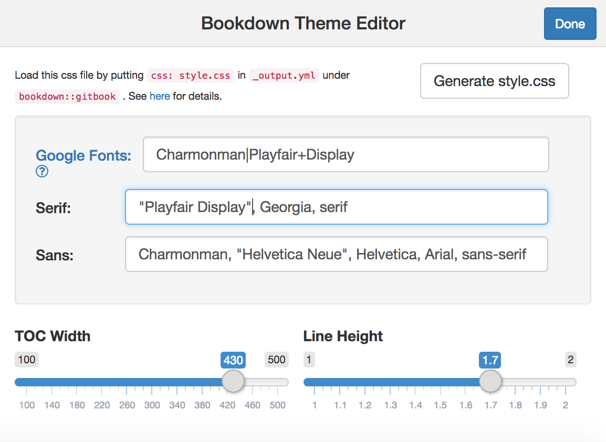
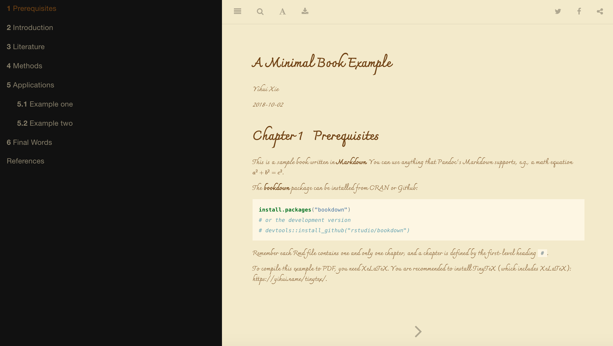

# bookdownThemeEditor

bookdownThemeEditor provides an RStudio addin that helps you easily customize the look of `bookdown::gitbook`.

## Installation
Right now you can only get this awesome package on github. 

``` r
devtools::install_github("hebrewseniorlife/bookdownThemeEditor")
```

## How to use

The only external function in this package is an RStudio Addin. It has a graphical interface, which is easy to use. ;)

Basically it helps you generates a `style.css` file, which you can put in your `bookdown` project folder. You will need to load this css by yourself by putting something like this in your `_output.yml`.

```
bookdown::gitbook: 
  css: style.css
```



Result you will get after you load `style.css`.



## What's the difference between using this app and creating my own stylesheet?

There is no difference except it's just easier to use this app. I spent some time to figure out which CSS tag needs to be modified so you don't need to. ;)
